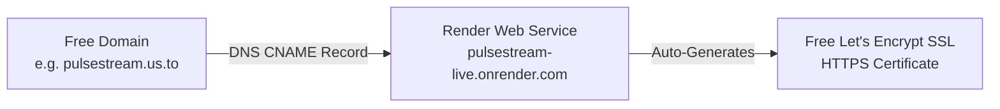

# Complete Guide: How to Obtain a Free Custom Domain Name

This guide details **every legitimate, working method to get a free custom domain name** for your PulseStream live streaming platform, along with step-by-step instructions to connect it to **Render** and **Cloudflare** with free SSL/TLS.

---

## ⚠️ Important Warning: The Freenom Shutdown (.tk, .ml, .ga, .cf, .gq)

Many online articles and YouTube tutorials still recommend **Freenom** for free `.tk`, `.ml`, or `.ga` domains. 
- **Do not use Freenom**: Freenom permanently ceased operations following lawsuits and ICANN compliance termination.
- **Avoid scam clones**: Any third-party websites claiming to offer free `.tk` or `.ml` domains today are phishing portals or malware traps.

Below are the **real, active, and verified free domain options** available today.

---

## 1. Top 5 Permanent 100% Free Domain Providers

These services provide free domains or subdomains with **full DNS control** (A, CNAME, TXT records), allowing you to link them directly to Render.

```
┌─────────────────────────────────────────────────────────────────────────────────┐
│                           AVAILABLE 100% FREE OPTIONS                           │
├──────────────────────┬─────────────────────────┬────────────────────────────────┤
│ Provider             │ Domain Format           │ Best Feature                   │
├──────────────────────┼─────────────────────────┼────────────────────────────────┤
│ FreeDNS (afraid.org) │ yourname.us.to          │ 50,000+ domain options, instant│
│ DuckDNS.org          │ yourname.duckdns.org    │ 1-click GitHub login, high up  │
│ EU.org               │ yourname.eu.org         │ Treated like a real top-level  │
│ is-a.dev             │ yourname.is-a.dev       │ Professional dev prefix via Git│
│ FreeDomain.one       │ yourname.freedomain.one │ NetDorm backed, dynamic DNS    │
└──────────────────────┴─────────────────────────┴────────────────────────────────┘
```

---

### Option A: FreeDNS ([afraid.org](https://freedns.afraid.org)) ⭐ *(Recommended for Fast Launch)*

FreeDNS has operated continuously since **2001** and is the most reliable community-supported free DNS provider in the world.

#### Advantages:
- **100% Free forever** with no renewal fees.
- Choose from over **50,000 shared domain zones** (e.g., `.us.to`, `.strangled.net`, `.chickenkiller.com`, `.mooo.com`, `.crabdance.com`).
- Full support for **CNAME, A, AAAA, MX, and TXT** records.
- Instantly connects to Render and generates Let's Encrypt SSL.

#### Step-by-Step Setup:
1. Open [freedns.afraid.org](https://freedns.afraid.org).
2. Click **Subdomains** in the left menu.
3. Click **Add a subdomain**.
4. Register a free account (verify your email address).
5. In the subdomain creation form:
   - **Type**: Select `CNAME`.
   - **Subdomain**: Type your brand name (e.g. `pulsestream`).
   - **Domain**: Choose from the dropdown (e.g. `us.to`, `mooo.com`, or click *[Many many more available]* to search clean extensions).
   - **Destination**: Enter your Render web service URL:
     ```text
     pulsestream-live.onrender.com
     ```
6. Click **Save!**. Your free domain (e.g., `pulsestream.us.to`) is active globally within 5 minutes.

---

### Option B: DuckDNS ([duckdns.org](https://www.duckdns.org))

DuckDNS is a free dynamic DNS service hosted on Amazon Web Services (AWS) infrastructure.

#### Advantages:
- Sign in with 1 click using **GitHub** or **Google**.
- Zero ads, zero captcha verification, zero expiration.
- Free subdomain: `yourbrand.duckdns.org`.

#### Step-by-Step Setup:
1. Open [duckdns.org](https://www.duckdns.org).
2. Sign in in the top right using **GitHub** or **Google**.
3. Under **domains**, type your desired subdomain name (e.g., `pulsestream`).
4. Click **add domain**.
5. Note: DuckDNS natively sets an IP (A record). To point to Render via CNAME:
   - You can point the IP directly to Render’s anycast IP: `216.24.57.1`.
   - Or configure it in Cloudflare DNS for a CNAME redirect.

---

### Option C: EU.org ([nic.eu.org](https://nic.eu.org)) *(Most Professional Appearance)*

EU.org is a non-profit project founded in 1996 by French researchers to ensure individuals can access domain names without cost.

#### Advantages:
- You get `yourname.eu.org`.
- **Treated as an independent domain by Google, Cloudflare, and SSL issuers**, not as a shared subdomain.
- You can change your nameservers to **Cloudflare** and manage all DNS records professionally.

#### Step-by-Step Setup:
1. Open [nic.eu.org](https://nic.eu.org).
2. Click **Register** in the left menu and create a "contact handle" (account).
3. Confirm your email and log in.
4. Click **New Domain**:
   - Complete domain name: `pulsestream.eu.org`.
   - Administrative and technical contact: enter your handle.
   - Nameservers: Enter free Cloudflare nameservers (e.g. `aria.ns.cloudflare.com`).
5. Submit the application.
   *(Note: Because requests are reviewed manually by volunteers, approval takes between 1 to 3 weeks).*

---

### Option D: is-a.dev ([is-a.dev](https://is-a.dev)) *(For Open-Source & Devs)*

If your PulseStream code is hosted on a public or private GitHub repository, you can obtain a free `yourname.is-a.dev` domain.

#### Advantages:
- Clean, respected developer branding.
- Managed directly through Git Pull Requests.
- Full CNAME record support.

#### Step-by-Step Setup:
1. Fork the repository at [github.com/is-a-dev/register](https://github.com/is-a-dev/register).
2. In the `domains/` folder, create a new file named `pulsestream.json`.
3. Add the following content:
   ```json
   {
     "owner": {
       "username": "your-github-username",
       "email": "your-email@example.com"
     },
     "record": {
       "CNAME": "pulsestream-live.onrender.com"
     }
   }
   ```
4. Submit a Pull Request. Automated CI checks the record, and maintainers merge it within 24 hours.

---

### Option E: FreeDomain.one ([freedomain.one](https://freedomain.one))

FreeDomain.one is a free subdomain and Dynamic DNS routing service.

#### Legitimacy & Background:
- Operated by **NetDorm, Inc.**, an established ICANN-accredited registrar founded in 1998 (the parent company behind DnsExit).
- **Legitimate service**: Unlike fraudulent Freenom clones, FreeDomain.one is an active, functional service.

#### Advantages:
- **100% Free** with no credit card required upfront.
- Gives you a free subdomain: `yourname.freedomain.one`.
- Supports standard DNS records (CNAME, A) to connect to Render.
- Includes basic email forwarding and dynamic DNS update tools.

#### Drawbacks & Considerations for PulseStream:
- **Subdomain only**: You do not legally own the root domain; NetDorm owns `freedomain.one`.
- **Heavy upselling**: Prompts users with advertisements and paid WordPress hosting upsells.
- **Lower commercial trust**: For a live video and monetized token platform like PulseStream (where viewers buy tokens and creators cash out money), a `.freedomain.one` address can look like a test/throwaway site. FreeDNS (`.us.to`) or a $0.99 `.live` domain offers much cleaner branding.

#### Step-by-Step Setup:
1. Open [freedomain.one](https://freedomain.one).
2. Register a free account.
3. Choose your desired subdomain name (e.g., `pulsestream`).
4. Under DNS Management, add a **CNAME** record:
   - **Host**: `@` (or leave blank)
   - **Target**: `pulsestream-live.onrender.com`
5. In Render Dashboard, add `pulsestream.freedomain.one` under **Custom Domains**.

---

## 2. Free 1-Year Top-Level Domain (.me, .tech, .live) via Student Pack

If you have a school/university email address (`.edu`, `.ac.uk`, etc.) or a student ID card:

### GitHub Student Developer Pack ([education.github.com/pack](https://education.github.com/pack))
1. Apply with your student verification.
2. Once approved, you receive:
   - **Namecheap**: 1 Free `.me` domain registration for 1 full year + free SSL certificate.
   - **Name.com**: 1 Free `.tech`, `.live`, or `.studio` domain registration for 1 full year.
3. You get full ownership and full DNS control to point the apex and `www` records directly to Render or Cloudflare.

---

## 3. The "$1 for a Full Year" Alternative (Real Top-Level Domain)

If you prefer a clean, brandable top-level domain without any `.us.to` or `.org` extensions, standard registrars offer first-year promotions for **$0.99 to $2.00**:

| Registrar | Link | TLDs on Promo | Price (Full First Year) |
| :--- | :--- | :--- | :--- |
| **Porkbun** | [porkbun.com](https://porkbun.com) | `.xyz`, `.site`, `.top`, `.click` | **$0.99 – $1.99** |
| **Namecheap** | [namecheap.com](https://namecheap.com) | `.live`, `.online`, `.tech`, `.shop` | **$1.48 – $2.48** |
| **IONOS** | [ionos.com](https://ionos.com) | `.com`, `.net` | **$1.00** *(for first 12 months)* |

> [!TIP]
> Spending $1.00 for `yourstream.live` or `yourstream.xyz` gives you a professional, memorable domain that builds trust with paying streamers and viewers.

---

## 4. How to Connect Your Free Domain to Render & Cloudflare

Once you obtain your free domain (e.g., from FreeDNS, DuckDNS, or EU.org), follow these steps to connect it to your live application:



### Step 1: Add DNS CNAME Record in Your Domain Manager
In your free domain registrar (e.g. FreeDNS / afraid.org):
- **Type**: `CNAME`
- **Host / Name**: `@` (or leave blank for root), or `www`
- **Target / Value**: `pulsestream-live.onrender.com`
- **TTL**: `300` seconds (or Auto)

*(If using an IP-only provider like DuckDNS, use an **A Record** pointing to Render's Anycast IP: `216.24.57.1`).*

### Step 2: Add Custom Domain in Render Dashboard
1. Log in to [dashboard.render.com](https://dashboard.render.com).
2. Open your web service: **`pulsestream-live`**.
3. In the left navigation, click **Settings**.
4. Scroll down to **Custom Domains**.
5. Click **Add Custom Domain**.
6. Enter your domain name (e.g. `pulsestream.us.to`).
7. Click **Save**.

### Step 3: Automated SSL Certificate Verification
- Render will automatically verify the CNAME record against your free domain.
- Once verified, Render issues a **free Let's Encrypt SSL/TLS certificate**.
- Within 2 to 5 minutes, your domain will display a green checkmark: `Verified & Active`.
- Your site is now accessible via `https://pulsestream.us.to`!

---

## 5. Provider Summary Table

| Provider | Cost | Setup Time | DNS Control | Renewal Requirement | Recommended Use |
| :--- | :--- | :--- | :--- | :--- | :--- |
| **FreeDNS (afraid.org)** | **$0.00** | 5 mins | Full (CNAME/A/TXT) | Automatic (keep account active) | **Best overall 100% free choice** |
| **DuckDNS** | **$0.00** | 2 mins | A Record (IP) | Automatic | Quick testing with minimal setup |
| **EU.org** | **$0.00** | 1–3 weeks | Full (Custom NS) | Automatic | Best for true TLD appearance |
| **is-a.dev** | **$0.00** | 24 hours | CNAME | Annual PR verification | Best for public GitHub projects |
| **FreeDomain.one** | **$0.00** | 5 mins | CNAME / A | Automatic (free account) | Quick staging / personal testing |
| **GitHub Student Pack** | **$0.00** | 10 mins | Full Registrar | 1-year free (then standard rate) | Best for real `.me` / `.live` domains |
| **Porkbun / Namecheap** | **$0.99** | 2 mins | Full Registrar | 1-year promo (renew or transfer) | Best for professional commercial look |
