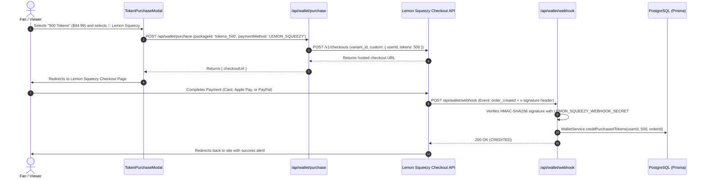

# Lemon Squeezy Integration Guide (PulseStream)

This guide provides complete, step-by-step instructions for integrating and using **Lemon Squeezy** as a Merchant of Record (MoR) payment gateway for your live streaming platform.

---

## 1. Why Lemon Squeezy?

Lemon Squeezy acts as your **Merchant of Record (MoR)**:
- **Global Tax & VAT**: Calculates, collects, and files sales tax/VAT across 135+ countries automatically.
- **Payment Methods**: Accepts Credit Cards, Debit Cards, Apple Pay, Google Pay, and PayPal.
- **No Complex Merchant Accounts**: Quick approval and simple API.
- **Instant Token Crediting**: Our webhook automatically verifies payments and credits tokens to user wallets in PostgreSQL.

---

## 2. Payment Flow Architecture



---

## 3. Step-by-Step Lemon Squeezy Dashboard Setup

### Step 1: Create an Account & Store
1. Go to [https://www.lemonsqueezy.com](https://www.lemonsqueezy.com) and create an account.
2. Complete your store profile:
   - Go to **Settings** → **Stores**.
   - Note your **Store ID** (e.g. `123456`). You can find this in your store settings or in the URL when viewing your store.

---

### Step 2: Create Token Package Products
You need to create products for each token tier.

1. Go to **Products** in the left sidebar → click **New Product**.
2. Create **Product 1 (Starter Pack)**:
   - **Name**: `100 Stream Tokens`
   - **Type**: Single payment (Digital Product)
   - **Price**: `$9.99`
   - Save the product.
3. Create **Product 2 (Popular Pack)**:
   - **Name**: `500 Stream Tokens`
   - **Price**: `$44.99`
   - Save the product.
4. Create **Product 3 (VIP Pack)**:
   - **Name**: `1,200 Stream Tokens`
   - **Price**: `$99.99`
   - Save the product.

#### How to find the Variant ID for each product:
1. Click on the product you created.
2. Scroll to the **Variants** section.
3. Click the three dots `...` next to the variant → copy the **Variant ID** (a number, e.g. `589124`).
4. Note the Variant IDs for 100, 500, and 1200 tokens.

---

### Step 3: Generate Your API Key
1. Go to **Settings** → **API Keys**.
2. Click **Create API Key**.
3. Name it: `PulseStream Production`.
4. Copy the secret key (it begins with `eyJ...`). Store it safely.

---

### Step 4: Configure Webhooks
The webhook is what tells your server that a payment succeeded so tokens can be credited immediately.

1. Go to **Settings** → **Webhooks** → click **Add Webhook**.
2. Set **Callback URL** to:
   ```text
   https://live-event-uz3r.onrender.com/api/wallet/webhook
   ```
   *(For local testing, use your ngrok or local tunnel URL: `https://your-tunnel.ngrok.io/api/wallet/webhook`)*
3. **Signing Secret**: Enter a secure random string (e.g., `whsec_lemonsqueezy_pulse_live_2026`).
4. Under **Events**, check:
   - `order_created` *(Required: triggers when a token pack is purchased)*
   - `subscription_created` *(Optional: if you offer monthly streamer fan clubs)*
   - `subscription_cancelled` *(Optional)*
5. Click **Save Webhook**.

---

## 4. Environment Variables Configuration

Add the following variables to your local `.env` and to your **Render Web Service Settings → Environment**:

```env
# ==========================================
# Lemon Squeezy Payment Gateway
# ==========================================
LEMON_SQUEEZY_API_KEY="your_api_key_here"
LEMON_SQUEEZY_STORE_ID="123456"
LEMON_SQUEEZY_WEBHOOK_SECRET="whsec_lemonsqueezy_pulse_live_2026"

# Variant IDs created in Lemon Squeezy Dashboard
LEMON_SQUEEZY_VARIANT_100="589124"
LEMON_SQUEEZY_VARIANT_500="589125"
LEMON_SQUEEZY_VARIANT_1200="589126"
```

---

## 5. Testing in Lemon Squeezy Test Mode

Lemon Squeezy provides a full sandbox mode before you go live:

1. In the bottom-left corner of the Lemon Squeezy dashboard, switch the toggle from **Live** to **Test Mode**.
2. When creating products/variants in Test Mode, copy the test variant IDs.
3. Create a Test API Key and Test Webhook.
4. Open the site modal → choose **🍋 Lemon Squeezy** → Click **Buy Tokens**.
5. On the checkout page, use test credit card details:
   - **Card Number**: `4242 4242 4242 4242`
   - **Expiry Date**: Any future date (e.g. `12/28`)
   - **CVC**: `123`
6. Complete checkout.
7. Within 1–2 seconds, the webhook fires and credits the tokens to your user wallet balance in PostgreSQL.

---

## 6. Codebase Files Reference

| File | Purpose |
|------|---------|
| [`src/lib/payment/lemonSqueezyAdapter.ts`](file:///c:/Users/XPRISTO/Desktop/tva/Live_event/src/lib/payment/lemonSqueezyAdapter.ts) | Implements checkout creation and HMAC signature verification |
| [`src/lib/payment/interface.ts`](file:///c:/Users/XPRISTO/Desktop/tva/Live_event/src/lib/payment/interface.ts) | Defines `SupportedPaymentMethod` including `'LEMON_SQUEEZY'` |
| [`src/lib/payment/index.ts`](file:///c:/Users/XPRISTO/Desktop/tva/Live_event/src/lib/payment/index.ts) | Registers `LemonSqueezyProcessor` in the payment factory |
| [`src/app/api/wallet/purchase/route.ts`](file:///c:/Users/XPRISTO/Desktop/tva/Live_event/src/app/api/wallet/purchase/route.ts) | Calls the Lemon Squeezy checkout session endpoint |
| [`src/app/api/wallet/webhook/route.ts`](file:///c:/Users/XPRISTO/Desktop/tva/Live_event/src/app/api/wallet/webhook/route.ts) | Detects `x-signature` header, validates HMAC, and credits tokens |
| [`src/components/wallet/TokenPurchaseModal.tsx`](file:///c:/Users/XPRISTO/Desktop/tva/Live_event/src/components/wallet/TokenPurchaseModal.tsx) | User interface with the 🍋 Lemon Squeezy selection button |

---

## 7. Troubleshooting

- **"API Key or Store ID missing. Returning simulated checkout."**
  - Make sure `LEMON_SQUEEZY_API_KEY` and `LEMON_SQUEEZY_STORE_ID` are set in your environment variables.
- **"Webhook signature verification failed (400)"**
  - Ensure the `LEMON_SQUEEZY_WEBHOOK_SECRET` in your environment matches the Signing Secret entered in Lemon Squeezy Webhooks settings.
- **Tokens not crediting after checkout:**
  - Verify that your Render URL is publicly reachable and not throwing 502/500 errors.
  - Check the Webhook logs in Lemon Squeezy Dashboard (**Settings** → **Webhooks** → click your webhook → **Recent Deliveries**) to see the exact HTTP response code returned by your server.
