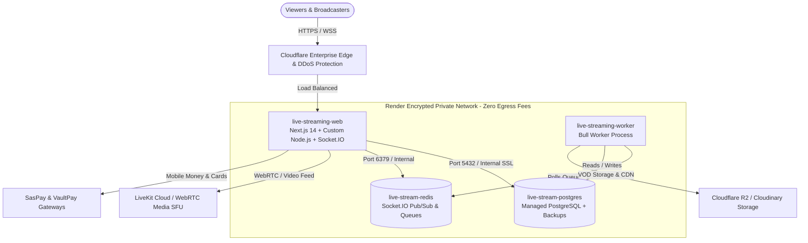

# Complete Guide: How to Entirely Benefit from Hosting on Render.com

This comprehensive guide details **how to maximize every benefit of hosting PulseStream on [Render.com](https://render.com)**. It covers architectural advantages, cost optimization, performance benchmarks, security compliance, and step-by-step instructions to get the absolute highest return on investment (ROI) from Render's Platform-as-a-Service (PaaS).

---

## 1. Executive Summary: Why Render is Built for PulseStream

PulseStream is a modern, high-concurrency live streaming and content monetization platform. Unlike basic static websites or traditional WordPress blogs, PulseStream requires:
1. **Next.js 14 App Router** with Server-Side Rendering (SSR) and API routes.
2. **Persistent Node.js Server (`server.js`)** running **Socket.IO** 24/7 for live chat, real-time tipping alerts, and viewer counts.
3. **Managed PostgreSQL Database** storing users, transactions, VODs, KYC, and private sessions.
4. **Managed Redis Key-Value Store** powering Socket.IO clustering, real-time presence, and rate-limiting.
5. **Asynchronous Background Worker** running Bull queues for subscription billing, automated VOD processing, and streamer cashouts.

### The Cloud Hosting Dilemma: Serverless vs. VPS vs. Render PaaS

| Dimension | Serverless (e.g., Vercel, Netlify) | Unmanaged VPS (e.g., Hostinger, Linode) | Render PaaS (Recommended) |
| :--- | :--- | :--- | :--- |
| **WebSockets / Socket.IO** | ❌ **Broken** (Serverless functions terminate after 15–60s) | ✅ Supported (Manual Nginx/PM2 setup required) | ✅ **Native & Persistent** (Persistent containers) |
| **Background Workers & Queues**| ❌ No persistent workers | ✅ Supported (Manual systemd setup) | ✅ **Dedicated Worker Services** |
| **Database Management** | ❌ Requires external DB provider | ⚠️ Manual backups, updates & security patches | ✅ **Fully Managed PostgreSQL + Automated Backups** |
| **Setup & Maintenance Time** | ⚡ Fast (for basic apps) | ⏳ **High** (15–25 hours of Linux sysadmin work) | ⚡ **1-Click Infrastructure-as-Code (`render.yaml`)** |
| **DevOps Overhead** | Low (until you hit serverless limits) | High (OS updates, firewalls, cert renewals) | **Zero** (Render manages hardware, OS, and SSL) |
| **Zero-Downtime Deploys** | ✅ Yes | ❌ Requires complex blue/green Nginx scripting | ✅ **Automatic with `/api/health` probes** |

> [!TIP]
> **The Bottom Line**: Hosting on Render gives you the **simplicity and Git-push workflow of Vercel** combined with the **raw persistent container power of a dedicated Linux server**, completely eliminating server administration headaches.

---

## 2. Top 10 High-Value Benefits of Hosting on Render

### 1. Native Support for Persistent WebSockets & Custom Server (`server.js`)
- Render runs full Node.js long-running Docker/Linux containers.
- **Why this matters for PulseStream**: Socket.IO connections remain alive continuously. Broadcasters and viewers never experience random chat disconnections, lost tip alerts, or broken stream counters.

### 2. Complete Infrastructure-as-Code via `render.yaml`
- The entire application architecture is codified in your project's [`render.yaml`](file:///c:/Users/XPRISTO/Desktop/tva/Live_event/render.yaml).
- **Benefit**: You don't need to manually configure 4 different dashboards. Clicking **New > Blueprint** in Render automatically provisions:
  1. `live-streaming-web` (Web Service)
  2. `live-streaming-worker` (Background Worker)
  3. `live-stream-postgres` (PostgreSQL Database)
  4. `live-stream-redis` (Redis Cluster)

### 3. Isolated Private Network with 0 Egress Fees
- All services in the blueprint communicate over Render’s internal private network (`.internal` hostnames).
- **Performance & Security**: Database queries and Redis pub/sub traffic never travel across the public Internet.
- **Cost Savings**: **$0 in internal bandwidth fees** between your web server, worker, database, and Redis cache.

### 4. Zero-Downtime Rolling Deployments & Instant Rollbacks
- Render builds your Next.js application in an isolated container.
- It tests your live health check endpoint: `/api/health`.
- Render **only routes live user traffic to the new version once the health check returns HTTP 200 OK**.
- If a build fails or crashes on startup, the previous working release remains live with **zero user disruption**. If needed, you can roll back to any previous commit in 1 click.

### 5. Fully Managed PostgreSQL with Automated Daily Backups
- Automated daily snapshots stored securely.
- Point-in-time recovery (PITR) available for data recovery.
- Built-in connection pooling and SSL encryption out of the box.
- Zero DBA maintenance: Render handles database security updates, OS patches, and disk management automatically.

### 6. Dedicated Background Worker Service (`live-streaming-worker`)
- PulseStream uses Bull Queue (`src/worker/bullWorker.ts`) to process payouts, recurring subscription billing, and video transcoding.
- On standard shared hosts, heavy background processing slows down the web server and causes video buffering.
- Render decouples the worker into a dedicated process, ensuring **web browsing and live stream viewing stay lightning fast** regardless of background workloads.

### 7. Cloudflare Enterprise DDoS Protection & Global CDN Included
- Render partners directly with Cloudflare Enterprise.
- Every web service automatically receives:
  - Global Anycast CDN caching.
  - Automatic HTTP/3 and HTTP/2 acceleration.
  - Layer 3, 4, and 7 DDoS attack mitigation.
  - High-volume traffic absorption during viral live stream events.

### 8. Automated Free SSL/TLS Certificates (Let's Encrypt)
- Render provisions, verifies, and auto-renews wildcard SSL certificates for your custom domain (e.g., `yourdomain.com` and `www.yourdomain.com`).
- No Certbot configuration, no expired SSL crises, and no manual certificate copying.

### 9. Seamless Vertical & Horizontal Scaling
- **Vertical**: If your platform experiences traffic surges, upgrade CPU and RAM with a single click (Starter → Standard → Pro) with zero migration or database dump required.
- **Horizontal**: Add multiple concurrent Web instances with automated load balancing. PulseStream's Redis adapter ensures Socket.IO messages synchronize seamlessly across all instances.

### 10. Automated Pull Request Preview Environments
- When team members or developers submit GitHub Pull Requests, Render can automatically spin up an ephemeral, temporary clone of the entire platform.
- You can test new live stream features, payment flows, or ad placements on a live URL before merging to production.

---

## 3. PulseStream Production Architecture on Render

---

## 4. Real-World Cost & Budget Analysis

Render provides transparent, predictable pricing with no hidden charges for build minutes or internal networking.

### Option A: Testing & Staging Tier (Free to Low Cost)

| Service | Plan | Monthly Cost | Notes |
| :--- | :--- | :--- | :--- |
| **Web Service** | Free | $0.00 | Spins down after 15 mins of inactivity (good for dev). |
| **PostgreSQL** | Free Tier | $0.00 | 1 GB storage, 30-day trial. |
| **Redis** | Free Tier | $0.00 | 25 MB memory (sufficient for basic testing). |
| **Worker** | Starter | $7.00 | Persistent background processor. |
| **Total Staging Cost** | | **~$7.00 / month** | |

---

### Option B: Production Starter Tier (Recommended for Launch) ⭐

This configuration provides **24/7 high availability, persistent containers with zero sleep**, dedicated CPU/RAM, and managed database backups:

| Resource | Render Plan | Specs | Monthly Cost |
| :--- | :--- | :--- | :--- |
| **`live-streaming-web`** | **Starter** | 0.5 CPU, 512 MB RAM (Always On, WebSockets active) | **$7.00** |
| **`live-streaming-worker`**| **Starter** | 0.5 CPU, 512 MB RAM (Dedicated background worker)| **$7.00** |
| **`live-stream-postgres`** | **Starter** | 1 GB RAM, 10 GB SSD, Daily automated backups | **$7.00** |
| **`live-stream-redis`**    | **Starter** | 256 MB RAM, In-memory persistence & Pub/Sub | **$7.00** |
| **SSL Certificate**       | Let's Encrypt | Included with auto-renewal | **$0.00** |
| **DDoS Protection**       | Cloudflare Enterprise | Layer 3/4/7 protection included | **$0.00** |
| **Internal Bandwidth**    | Render VPC | Unlimited internal traffic between services | **$0.00** |
| **Total Production Cost** | | **High Performance Production Stack** | **$28.00 / month** |

---

### Option C: Growth & Scale Tier (10,000+ Concurrent Viewers)

When your platform reaches high traffic volume:
- Upgrade Web Service to **Standard** (1 vCPU, 2 GB RAM = $25/mo) or enable **Autoscaling** (2–5 instances).
- Upgrade PostgreSQL to **Standard** (4 GB RAM, 64 GB SSD = $35/mo).
- Total: **~$75.00 – $120.00 / month** for an enterprise-grade live broadcasting infrastructure handling millions of monthly pageviews.

---

## 5. Step-by-Step Guide: How to Entirely Maximize Render

Follow these exact steps to deploy and extract 100% of Render's capabilities for PulseStream:

### Step 1: Connect Your GitHub Repository via Blueprint
1. Log into your [Render Dashboard](https://dashboard.render.com).
2. Click **New +** in the top navigation bar and select **Blueprint**.
3. Select your repository (`apachitech/Live_event` or your fork).
4. Render automatically detects [`render.yaml`](file:///c:/Users/XPRISTO/Desktop/tva/Live_event/render.yaml) and prepares all 4 services.

---

### Step 2: Configure Environment Secrets in Render
Render allows you to set secret environment variables once and share them securely:

| Environment Variable | Where to Get It | Purpose |
| :--- | :--- | :--- |
| `NEXT_PUBLIC_APP_URL` | Your Render domain (e.g. `https://pulsestream.onrender.com` or custom domain) | Base URL for callbacks & SEO |
| `JWT_SECRET` | Render will auto-generate this | Session authentication tokens |
| `DATABASE_URL` | Auto-linked from `live-stream-postgres` | PostgreSQL connection string |
| `REDIS_URL` | Auto-linked from `live-stream-redis` | Redis connection string |
| `LIVEKIT_URL` | [cloud.livekit.io](https://cloud.livekit.io) | Real-time WebRTC media server |
| `LIVEKIT_API_KEY` | LiveKit Dashboard | Stream room authentication |
| `LIVEKIT_API_SECRET` | LiveKit Dashboard | Stream room signing |
| `SASPAY_CLIENT_ID` | SasPay Portal (`saspay.me`) | Mobile Money & African payment rails |
| `SASPAY_CLIENT_SECRET` | SasPay Portal | Payment transaction verification |
| `VAULTPAY_MERCHANT_ID`| VaultPay Portal | Virtual card processing |
| `STORAGE_PROVIDER` | Set to `r2` or `cloudinary` | Cloud media storage |
| `CLOUDINARY_URL` | Cloudinary Dashboard | VOD transcoding & replays |

---

### Step 3: Attach Your Custom Domain with Automated HTTPS
1. In the Render Dashboard, open **`live-streaming-web`**.
2. Go to **Settings > Custom Domains**.
3. Click **Add Custom Domain** and enter your domain (e.g., `yourstreamdomain.com` and `www.yourstreamdomain.com`).
4. Update your DNS settings at your domain registrar (Namecheap, GoDaddy, Cloudflare, etc.):
   - **Apex Domain (`@`)**: Add an **ANAME** or **ALIAS** record pointing to your Render service address (e.g., `live-streaming-web.onrender.com`), or an **A Record** pointing to Render's anycast IP: `216.24.57.1`.
   - **Subdomain (`www`)**: Add a **CNAME** record pointing to `live-streaming-web.onrender.com`.
5. Render immediately validates the DNS records and provisions an SSL certificate within 2 to 5 minutes.

---

### Step 4: Verify Zero-Downtime Health Check Probing
PulseStream includes a built-in health check endpoint at [`src/app/api/health/route.ts`](file:///c:/Users/XPRISTO/Desktop/tva/Live_event/src/app/api/health/route.ts):
- It tests database connectivity, Redis responsiveness, and system uptime.
- Render queries `GET /api/health` automatically every few seconds.
- If your app ever experiences an unhandled memory exception, Render automatically restarts the container without manual intervention.

---

### Step 5: Leverage Automated Backups & Disaster Recovery
1. Open **`live-stream-postgres`** in the Render Dashboard.
2. Click the **Backups** tab.
3. Render automatically performs daily snapshots and stores them with encryption.
4. You can click **Download Backup** at any time to save a local SQL dump, or click **Restore** to revert to any previous state in the event of an emergency.

---

### Step 6: Enable Real-Time Log Streaming & Alerts
1. In the **Logs** tab of each service, you can inspect live stdout/stderr streams in real time.
2. Render supports integrations with:
   - **Slack / Discord Webhooks**: Receive immediate notifications if a deployment succeeds or if a service fails.
   - **Log Streams (Datadog, Papertrail, Logtail)**: Stream all application logs to external monitoring suites for long-term audit compliance.

---

## 6. Comparison: Render vs. Self-Hosted VPS (Hostinger)

| Feature | Render PaaS | Self-Hosted VPS (Hostinger KVM) |
| :--- | :--- | :--- |
| **Initial Deployment Speed** | ⚡ **5 Minutes** (Push to Git) | ⏳ **3 to 5 Hours** (Install Ubuntu, Nginx, Certbot, PM2, DB, Redis) |
| **Ongoing Maintenance** | **0 hours/month** (Render manages hardware & OS) | **5–10 hours/month** (Security updates, logs, restarts) |
| **Automated Rollback** | 1-Click in Dashboard | Manual `git revert`, rebuild & manual restart |
| **PostgreSQL Maintenance** | Automated backups & point-in-time recovery | Manual cron jobs & `pg_dump` management |
| **DDoS Mitigation** | Built-in Cloudflare Enterprise | Basic firewall (requires manual Cloudflare setup) |
| **WebSockets Reliability** | Managed persistent container | Depends on PM2 daemon and Nginx config stability |
| **Monthly Cost** | **$21 – $28 / mo** (Fully Managed) | **$8 – $14 / mo** (Unmanaged raw server) |
| **Best For** | **Focusing on product, marketing & revenue** | Developers who want full root access to Linux |

---

## 7. Operational Best Practices on Render

1. **Keep Database Credentials Dynamic**: Always use Render's `fromDatabase: { property: connectionString }` in `render.yaml`. This ensures that if the database password or host changes during maintenance, your web app updates automatically without breaking.
2. **Use Redis Connection Pooling**: In `src/lib/redis.ts`, keep connections pooled so the web service and worker reuse open sockets efficiently.
3. **Store Uploaded Media in Cloudflare R2 / Cloudinary**: Container filesystems on Render (like Heroku or AWS ECS) are ephemeral. Always store user avatars and recorded VOD videos in cloud storage (R2 or Cloudinary) using the included adapters.
4. **Monitor `/api/health`**: You can ping `https://your-app.onrender.com/api/health` using free monitoring tools like [UptimeRobot](https://uptimerobot.com) or BetterStack to receive instant SMS/email alerts if your platform ever goes down.

---

## 8. Summary & Next Steps

Hosting PulseStream on Render delivers **enterprise-grade reliability, continuous Socket.IO connections, zero-maintenance database management, and hands-free deployments** at a fraction of the cost of dedicated DevOps engineers.

To deploy now:
1. Ensure your latest changes are pushed: `git push origin main`.
2. Go to **[dashboard.render.com](https://dashboard.render.com)**.
3. Select **New + > Blueprint**, pick your repository, and click **Apply**.
4. Your live streaming platform will be live globally in under 5 minutes.
